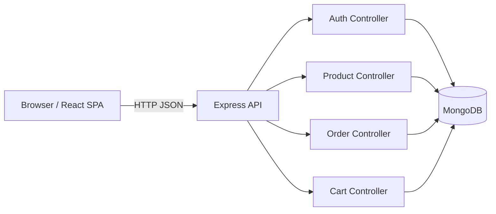

# Architecture

## High-level diagram



## Repository structure

```text
fullstack-eshop/
├── client/
│   ├── src/
│   │   ├── components/      # UI building blocks
│   │   ├── context/         # auth context/hooks
│   │   ├── pages/           # route views
│   │   └── services/        # API helpers
│   └── scripts/             # smoke test script
├── server/
│   ├── controllers/         # route handlers
│   ├── middleware/          # auth & role checks
│   ├── models/              # mongoose schemas
│   ├── routes/              # API route modules
│   └── tests/               # Node test runner API tests
└── docs/
    ├── ARCHITECTURE.md
    └── SCREENSHOTS.md
```

## Request flow (example: authenticated product create)

1. Client sends `POST /api/products` with `Authorization: Bearer <token>`.
2. `requireAuth` validates JWT and resolves user.
3. `requireAdmin` verifies role is `admin`.
4. Product controller validates payload and persists product.
5. API responds with created product JSON.
